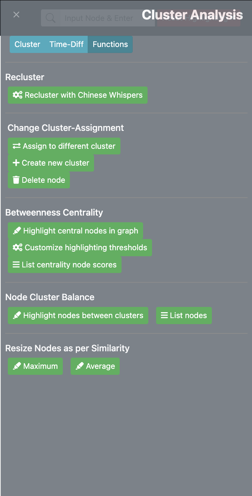
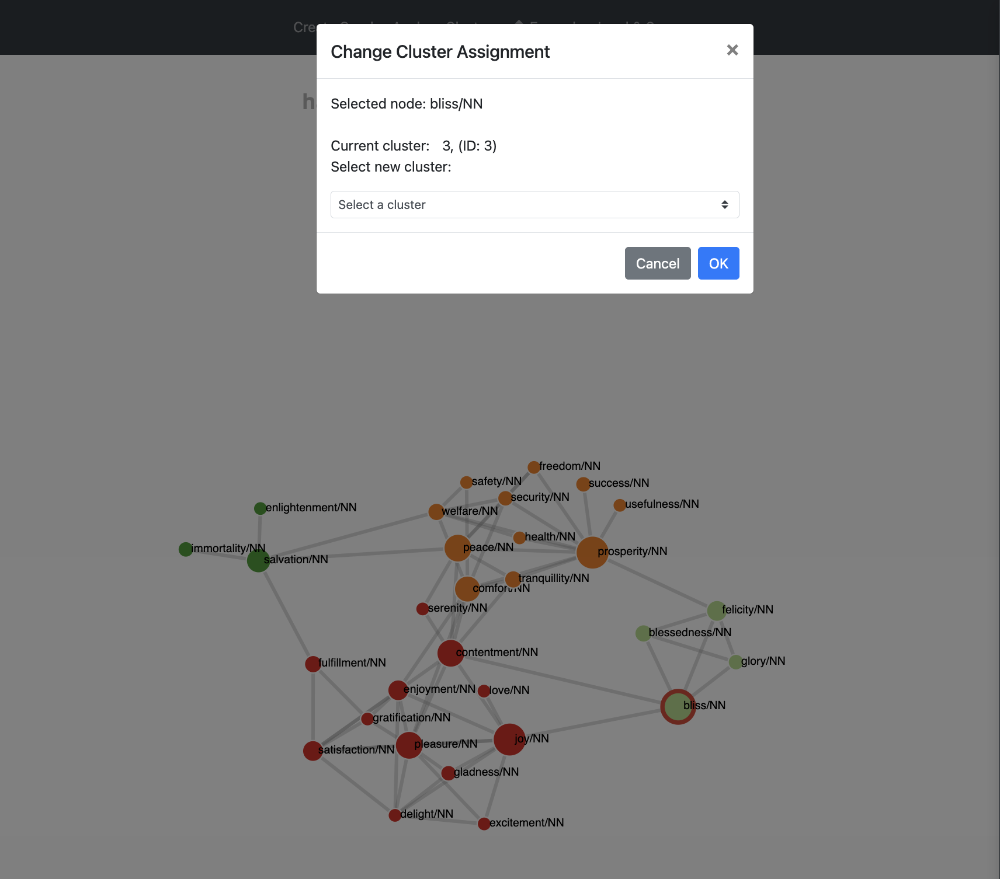
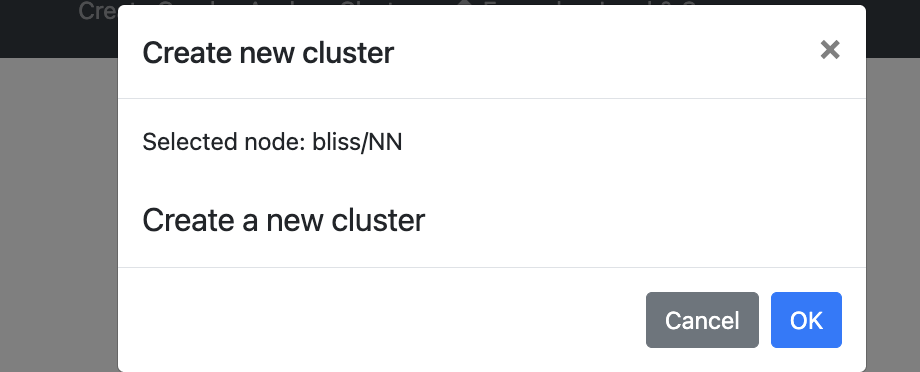
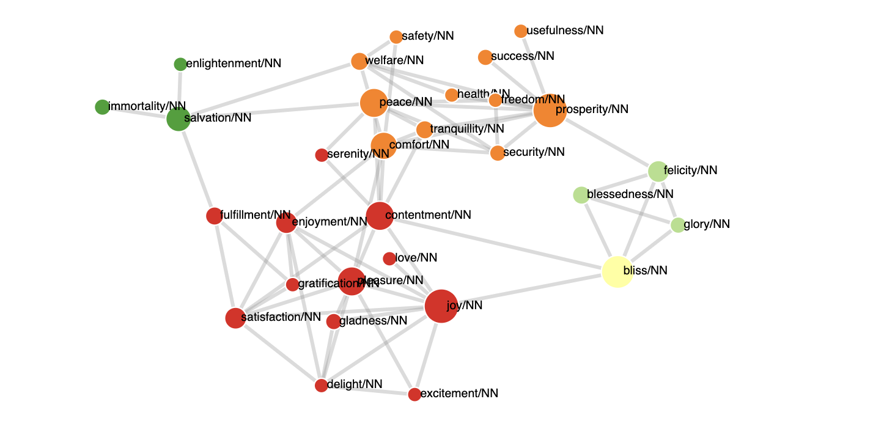
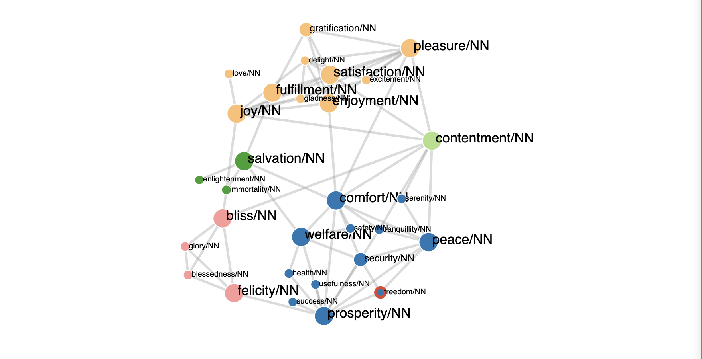
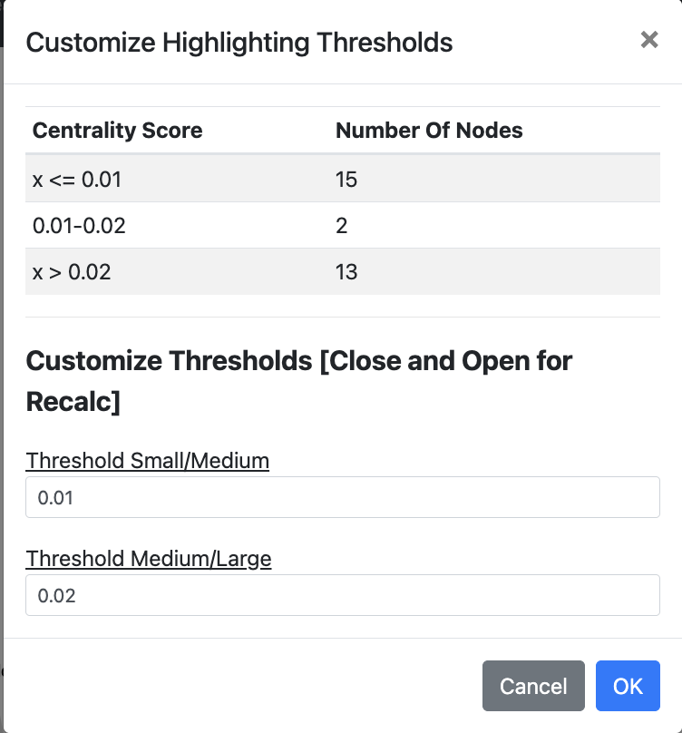
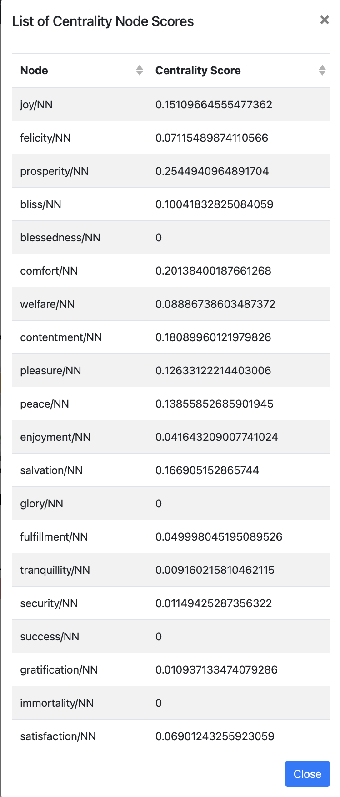
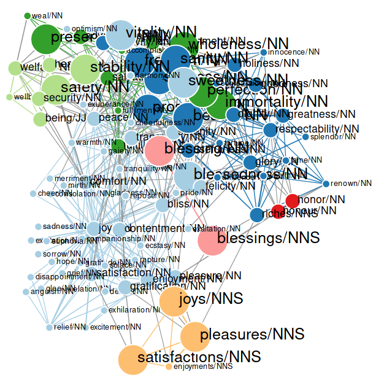
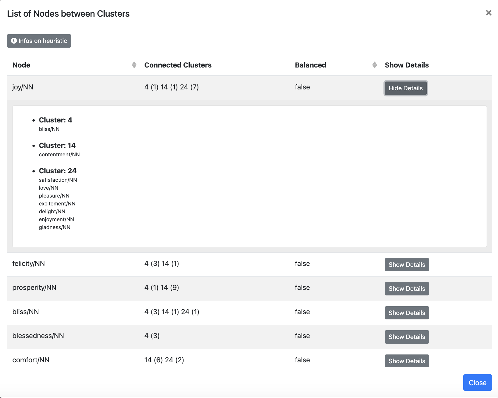
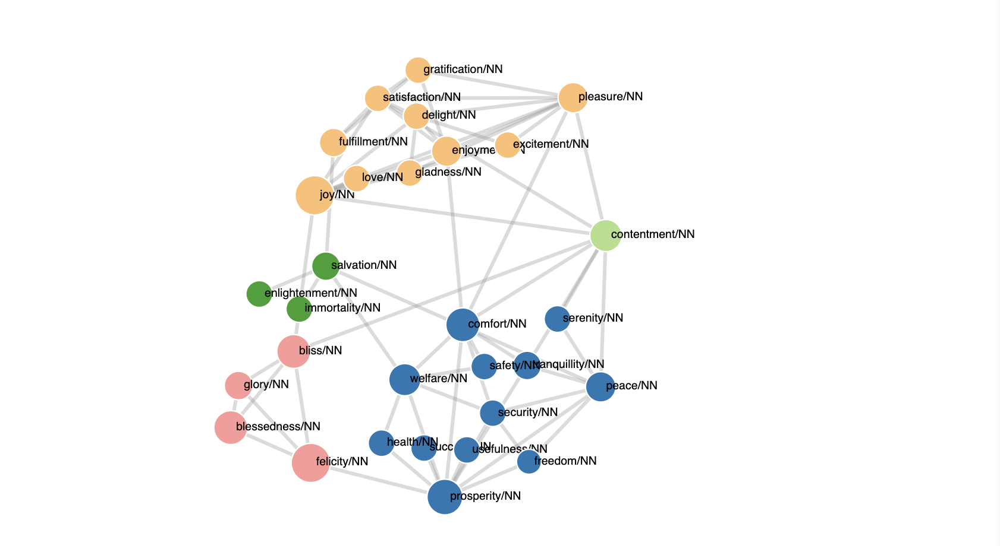

# Functions Mode

[Back to user guide contents list](userGuide.md)

When selecting "Functions" mode in the cluster-analysis sidebar on the right-hand side, the following functionality is available:
* [Reclustering](#reclusturing)
* [Change Cluster Assignment](#change-cluster-assignment)
* [Betweenness Centrality](#betweenness-centrality)
* [Node Cluster Balance](#node-cluster-balance)
* [Resize Nodes as per Similarity](resize-nodes-as-per-similarity)

## Change Cluster Assignment
Under the Change Cluster Assignment section, there are three functions available to the user for any particular clicked node from the graph:

1. Assigning the node to a different cluster
2. Creating a new cluster and assigning the node to it
3. Delete the node from the graph

### Assigning a Node to a Different Cluster
To support free editing of graphs for various purposes, users can assign nodes to a different existing cluster.

After selecting the option "Assign to different cluster", a modal is opened,  which shows the selected node, its current cluster, and a dropdown field from which the user can select the new cluster of the node.

On clicking "OK", the node's colour changes to the one of the newly assigned cluster. It also changes the cluster in the cluster list.

[To the top](#interacting-with-the-graph)

### Creating a New Cluster for a Node

If the user does not agree with the cluster assignment of a node and does not feel that the node would fit into any of the other clusters, the user can create a new cluster for a node.
For this, the user selects the option "Create new cluster". The following modal is displayed to the user.

The selected node is displayed to the user, so that they can verify that they are working on the correct node. After clicking the "OK" button in the modal, the new cluster is created. A new name and color is assigned to this cluster and it also now appears in the "Cluster" list in the Cluster Analysis bar. The cluster can be edited as explained in the [Cluster analysis options.](clusters.md) Other nodes can also be assigned to the newly created cluster via the function "Assign to different cluster".

The image above shows the node "Bliss" as a new cluster.

[To the top](#interacting-with-the-graph)

### Deleting a Node
A selected node in the graph and the links connecting it to any of the nodes in the graph can deleted via the "Delete node" button. This applies for both normal word nodes as well as cluster nodes. 

[To the top](#interacting-with-the-graph)

## Betweenness Centrality

Betweenness centrality is a common measure of centrality for graphs based on shortest paths. The betweenness centrality for each node is the number of shortest paths that pass through it. For more information see [Wikipedia](https://en.wikipedia.org/wiki/Betweenness_centrality) and the [Networkx documentation](https://networkx.github.io/documentation/latest/reference/algorithms/generated/networkx.algorithms.centrality.betweenness_centrality.html#networkx.algorithms.centrality.betweenness_centrality).

### Highlight central nodes in graph

The first option in this is to "Highlight central nodes in graph". Depending on their betweenness centrality score the nodes are displayed in different sizes.

{:height="75%" width="75%"}

A node can have one of three possible sizes depending on their centrality score. The defaults are:

1. Small nodes - nodes that have a centrality score of less than or equal to 0.01
2. Medium-sized - nodes that have a centrality score between 0.01 and 0.02
3. Large nodes - nodes that have a centrality score greater than 0.02

### Customize Highlighting Thresholds

This option allows the user to determine which nodes should be small, medium-sized, or large based on their betweenness centrality score.

{:height="50%" width="50%"}

Note: To revert back to the original sizes of the nodes, the user can click on the option "Reset highlighting" from the top nav-bar.

### List Centrality Node Scores

When the user selects the option "List centrality node scores" all the nodes are listed together with their respective betweenness centrality scores. The columns of the table are sortable.

{:height="50%" width="50%"}

[To the top](#the-functions-of-the-navbar)

## Node Cluster Balance

This provides the option for highlighting nodes that are connected to more than one cluster with around the same amount of edges, also known as "hubs". Clicking on the option "Highlight nodes in graph" results in the increased size of some nodes in the graph. There are three different sizes:

1. Small nodes - are only connected to nodes within the same cluster
2. Medium-sized nodes - are connected to more than one cluster, but do not have a balanced neighbourhood
3. Large nodes - are connected to more than one cluster and have a balanced neighbourhood

{:height="75%" width="75%"}

We use a heuristic to decide whether a node has a balanced neighbourhood or not.

We assume that the neighbourhood of a node is balanced, if there are at least two clusters for which
**max - d_i < mean/2** holds true.

Where

* *max* is the highest number of links the node has with any single cluster. This represents the cluster the node is most strongly connected to.
* *d_i* is the number of links between the node and a specific cluster i.
It measures how strongly the node is connected to that particular cluster.
* *mean* is the average number of links between the node and all neighbouring clusters. This gives an overall measure of how evenly the node is connected across clusters.

Note: To revert back to the original sizes of the nodes, the user can click on the option "Reset highlighting" from the top nav-bar.

Selecting the option "List nodes" gives the user information about the neighbourhood of each node. For each node the connected clusters are listed, as well as the number of nodes this specific node is connected to in each respective cluster. The list also tells the user, if the neighbourhood of the node was considered balanced or not. When the user clicks on the button "Infos on heuristic", they can see the heuristic we used to decide whether a node has a balanced neighbourhood.

{:height="75%" width="75%"}

Clicking on the "Show Details" button lists all the nodes the node is connected to grouped by cluster.

[To the top](#the-functions-of-the-navbar)

## Recluster Option

The clusters in the graph are calculated using the Chinese Whispers algorithm. The algorithm is very fast, but non-deterministic. So you never know upfront how many clusters you will get and which nodes will belong to which cluster. Because of this, executing the algorithm several times may result in a different clustering each time. 

The user can execute the algorithm again by clicking on the button "Recluster with Chinese Whispers".
This way, the user is able to see different hypothesis the system assumes about the senses of the target word. For more information on the Chinese Whispers Clustering Algorithm click [here](https://www.inf.uni-hamburg.de/en/inst/ab/lt/publications/2006-biemann-cw-textgraph.pdf).

[To the top](#the-functions-of-the-navbar)

## Resize Nodes as per Similarity
This section changes the size of graph nodes based on how semantically similar they are to the target word over time. The available options are: Maximum & Average.

<!-- Maximum - resizes nodes using the highest similarity value the node reaches in any time interval. This highlights nodes that were extremely important or strongly related at least once in time. -->

Maximum - resizes nodes using their highest similarity score observed in any selected time interval. This emphasizes words that were strongly related to the target word at least once.

Average - resizes nodes using the average similarity across all time intervals. This is set by default when a graph is created. This emphasizes nodes that have a strong relationship with the target word over time.

[To the top](#the-functions-of-the-navbar)
