# Cluster-Analysis-Menu

[Back to user guide contents list](userGuide.md)

After clicking the Analyse Clusters button in the navigation bar, SCoT opens the Cluster Analysis Menu on the right-hand side of the screen. This panel allows users to inspect, compare, edit, and analyze the clusters generated from the graph.

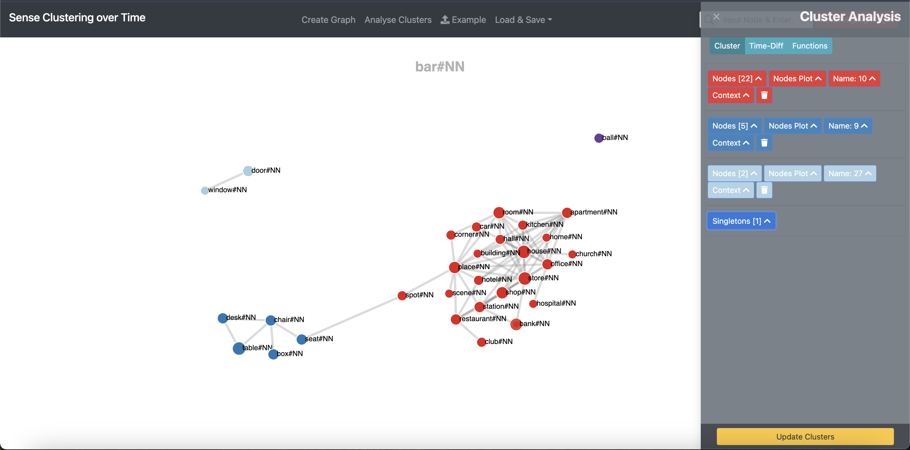

## Contents
* [Editing the Clusters](#editing-the-clusters)
* [Edit Cluster Name](#edit-cluster-name-&-colour)
* [Edit Cluster Colour](#edit-cluster-name-&-colour)
* [Nodes Plot](#view-nodes-plot)
* [Cluster Context Analysis](#cluster-context-analysis)
* [Delete Complete Cluster](#delete-complete-cluster)

[To the top](#editing-the-graph-via-the-functions-of-the-editing-sidebar)

## Editing the Clusters

Each cluster is displayed as an expandable panel in the analysis menu.
For every cluster, SCoT provides:
* the number of nodes in the cluster,
* a nodes plot,
* option to change cluster name/color,
* option to show the context-words that are shared by all nodes of the cluster,
* and cluster deletion functionality.

Clusters are colour-coded and correspond directly to the colours used in the graph visualization.

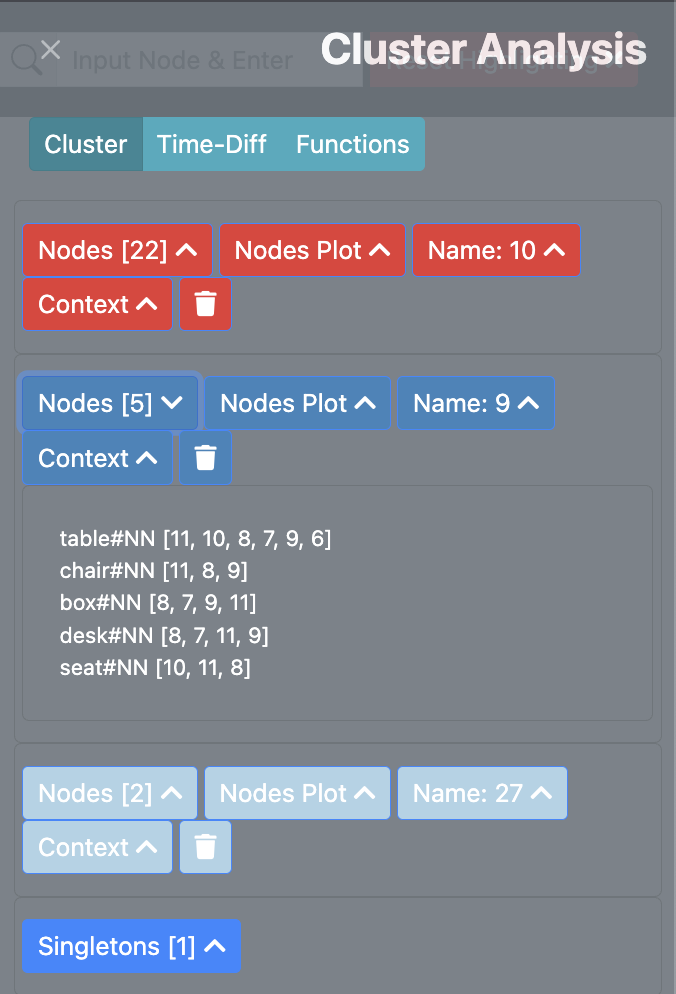

When hovering over the cluster and context buttons, all the nodes and edges in the graph belonging to the cluster are faded in in the graph.

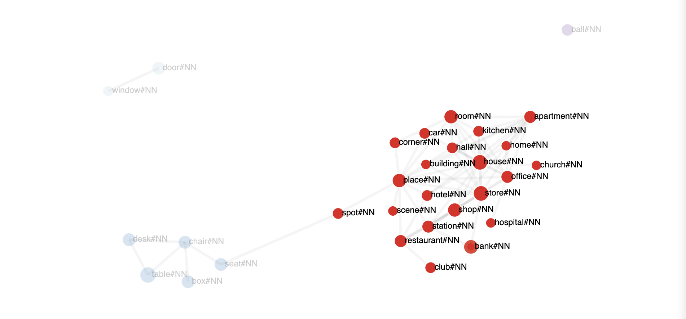

In some cases, nodes are not connected to any other in the graph. They are only neighbours of the target word. Then, the nodes are not rendered in the graph, but they are listed under "Singletons" in the edit column.

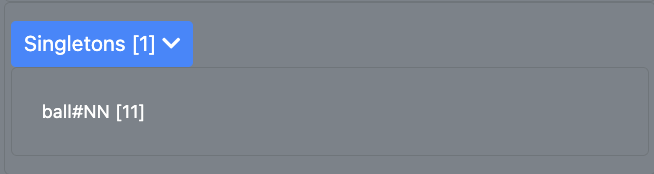

## Edit Cluster Name & Colour

The program only numbers the clusters and it is up to the user to name the cluster. Users can rename clusters and also assign custom colours through the Name section.

The user can:
* change the cluster name,
* display the cluster label inside the graph,
* and select a custom cluster colour using the colour picker.

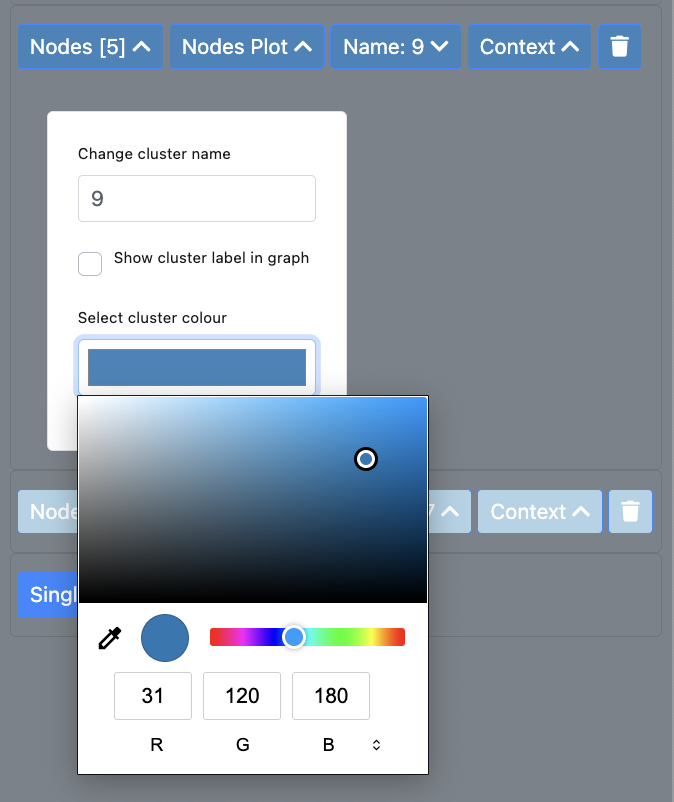{:height="40%" width="40%"}

The user can enter the new name in the text input field "Change cluster name". The name of the cluster is automatically updated while typing. The user can also select a different cluster colour by clicking on the colour field with the label "Select cluster colour" when editing a cluster. Then a colour picker opens and the user can select the new colour. Your colour picker may look different to the one in the image, since the appearance of the colour picker depends on your browser. The colour of the circle next to the cluster name is directly updated. 

However, the graph updates with the new name and color after clicking "Update Clusters" at the bottom of the analysis panel. The user can edit multiple clusters before clicking the "Update Clusters" button to make the updated visible in the graph.

[To the top](#editing-the-graph-via-the-functions-of-the-editing-sidebar)

## View Nodes Plot

The Nodes Plot shows the aggregated average frequency and similarity of cluster nodes across different time intervals. It helps users observe how strongly connected and how frequently used the cluster terms are over time.

Users can also compare multiple clusters in the same plot by selecting "Add other clusters" from the list below the graph. This makes it easier to identify semantic trends, changes in importance, and similarities or differences between clusters over time.

  <table>
    <tr>
      <td align="center">
        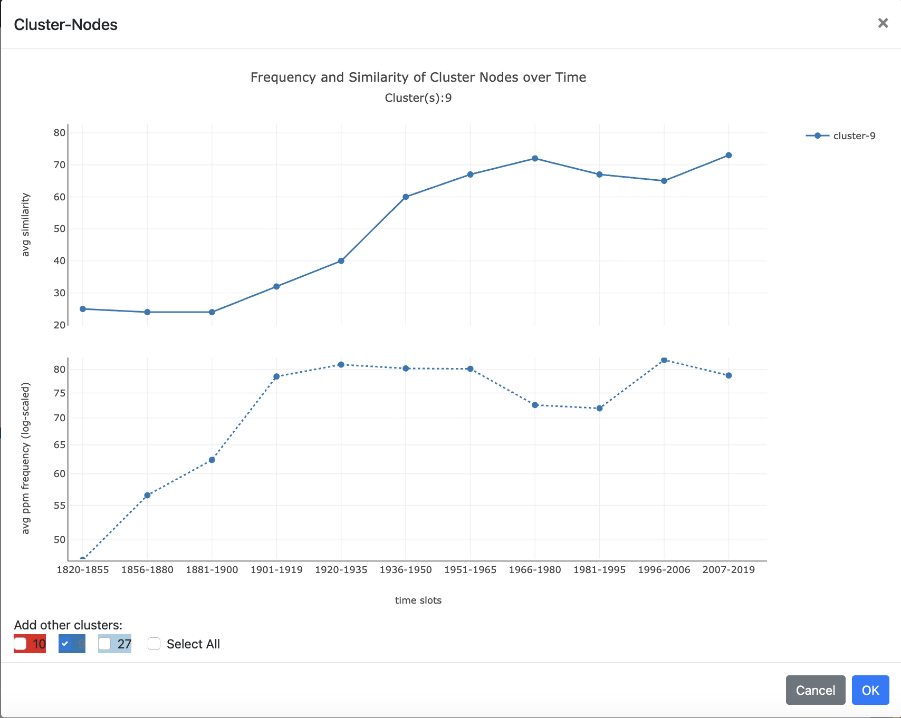
         
        <em>Single cluster nodes plot</em>
      </td>
      <td align="center">
        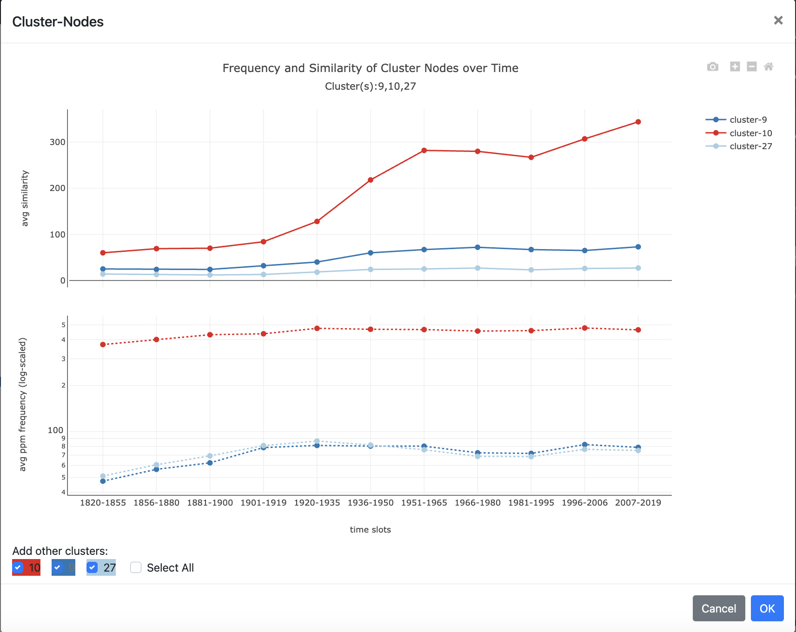
         
        <em>Multiple cluster comparison plot</em>
      </td>
    </tr>
  </table>

Users can interact with the graph by "zooming-in or zooming-out" and can also download the generated plot via the "camera icon" at the top. 

## Cluster Context Analysis

The context section shows the most significant syntagmatic contexts of the nodes of a cluster.

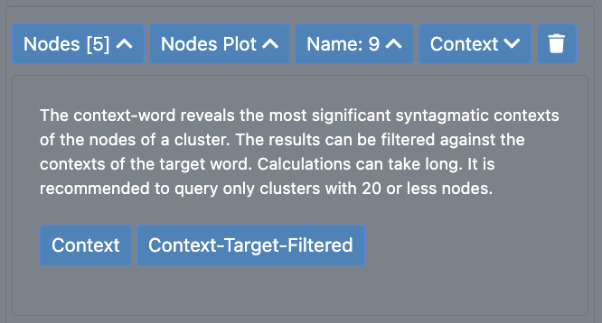

By clicking the "Context" button, a table opens to the left which shows all context words/features for all nodes in the selected cluster across all selected time intervals. It adds up their significance scores, normalizes them, and returns the top 200 context words. Which means it shows the most important shared context words for the cluster overall. 

The "Context-Target-Filtered" on the other hand, first gets the context words of the original target word, then only keeps cluster context words that also appear in the target word’s context set. In simple words, it shows only the cluster context words that are also relevant to the main target word, making the result more focused.

By selecting context-words and clicking “Context-Frequency Plot”, users can generate a temporal visualization of context frequency over time. This plot helps users analyze when a context emerged, how important a context became, and whether a context increased or declined historically.

The selected context words are listed below for reference.

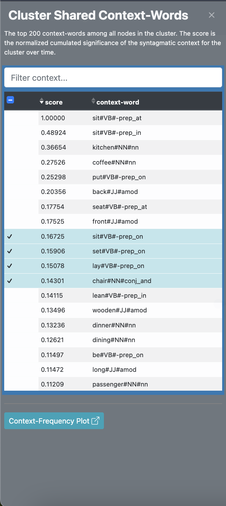
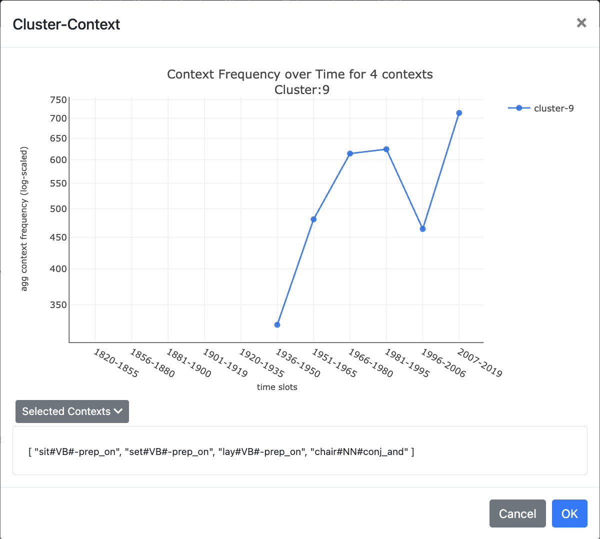

Users can filter the context-words using the search field to focus on specific semantic patterns of a target word. Calculations can take long. It is recommended to query only clusters with 20 or less nodes.

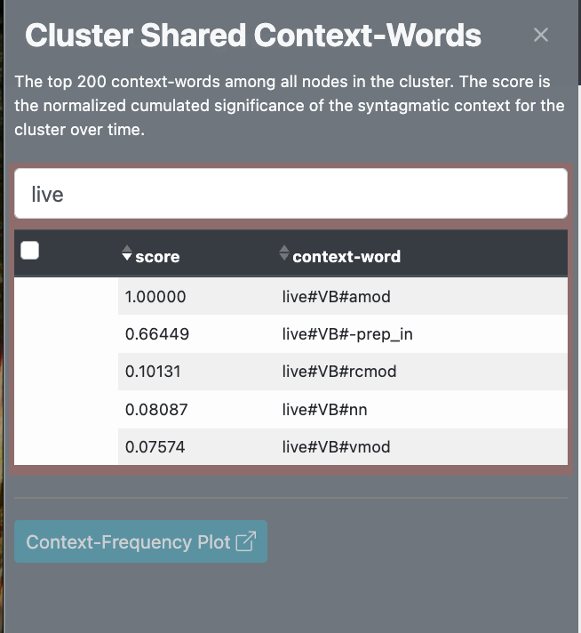

## Delete Complete Cluster

Complete cluster can be deleted via the button with the trash icon. The user then has to confirm the deletion in a confirmation message. When the user confirms all the nodes and links of the cluster are deleted.

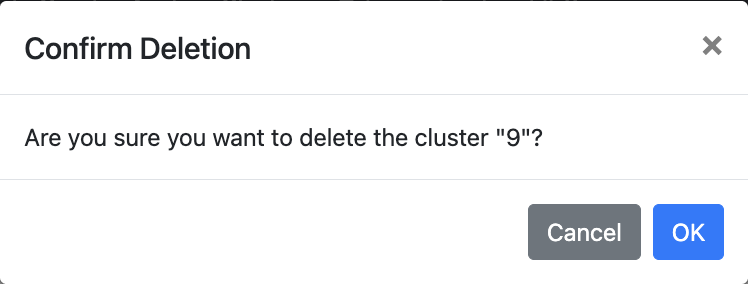{:height="75%" width="75%"}

[To the top](#editing-the-graph-via-the-functions-of-the-editing-sidebar)
