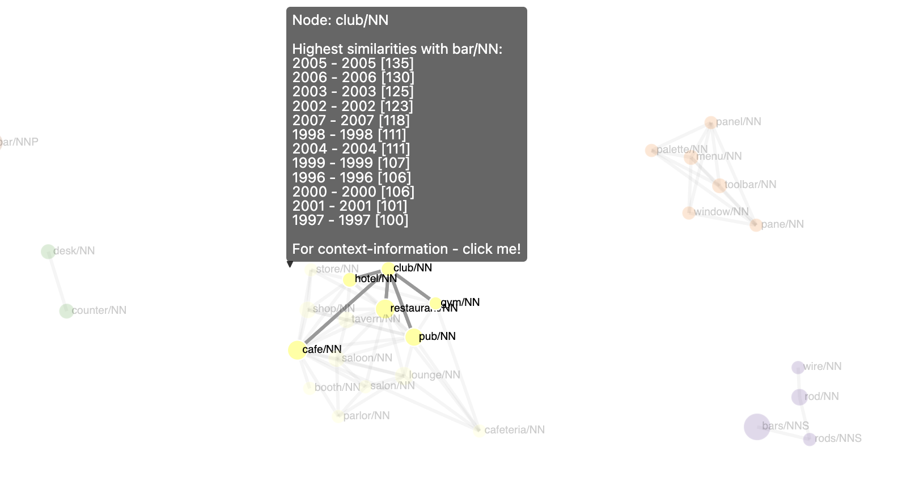
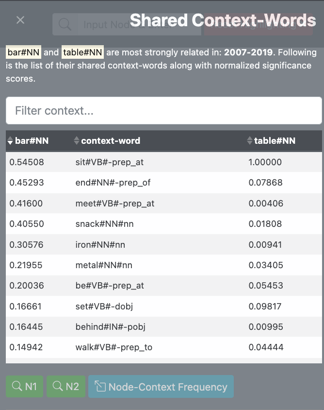
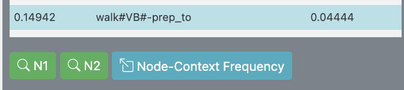
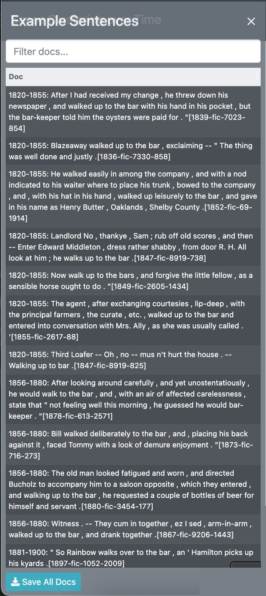
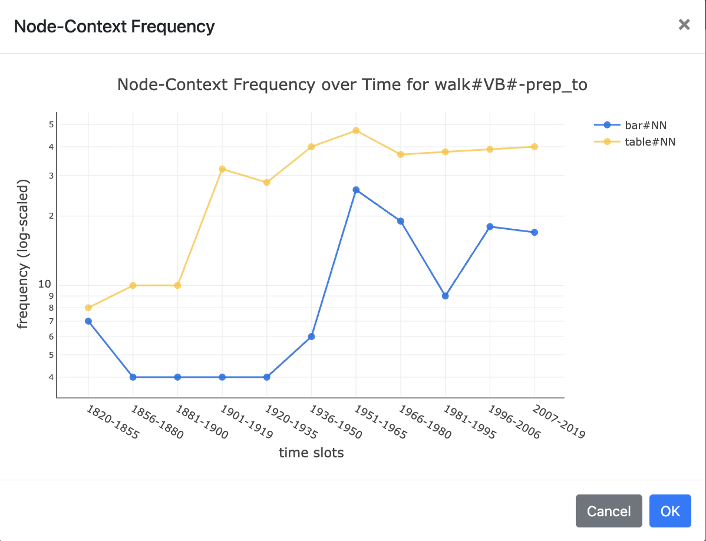
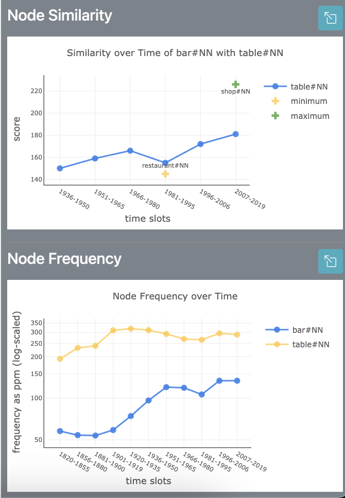
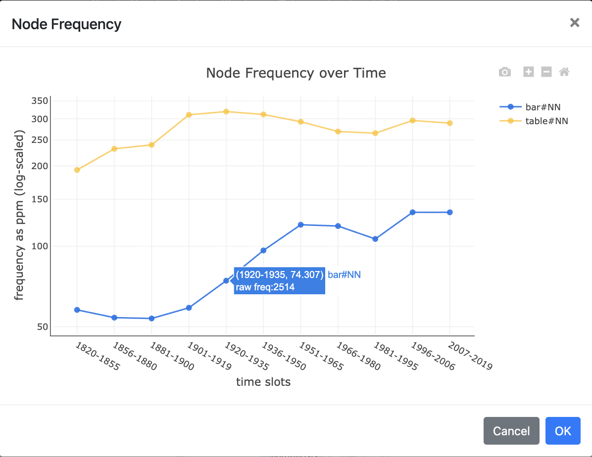
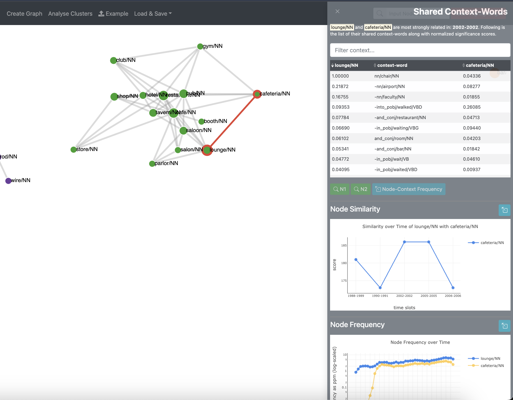

# Node Level Analysis

[Back to user guide contents list](userGuide.md)

SCoT introduces several context-mining functions that allow users to explore the linguistic data underlying the graph in greater detail.

The graphs in SCoT are generated from semantic similarity calculations based on syntagmatic context information extracted from large text corpora using the JoBim framework. For each word, JoBim identifies a set of significant context-words (features) and ranks them according to their statistical significance.

Based on these feature vectors, semantic similarity scores between words are calculated for each time interval. These similarity scores are then used to construct the graph and its clusters.

The context-mining functions allow users to move back from the visual graph representation to the underlying linguistic evidence.

## Node-Context

### Hovering over a Node
When the user hovers over a node in the graph, the selected node, its neighbouring nodes, and the edges connecting them are highlighted, while the remaining graph is faded out.

At the same time, a tooltip appears showing the similarity of the selected node with the target word across different time intervals.

For example, in the image above, the node club/NN has its highest similarity score with the target word "bar/NN" during the period 2005–2005. This means that bar/NN and club/NN were most strongly semantically related during that time interval.

### Clicking a Node
Clicking on a node opens the **Shared Context-Words** sidebar on the right-hand side of the screen.

This sidebar provides additional information about the relationship between the selected node and the target word. The sidebar contains three main components:
- [Shared Context-Word Table](#shared-context-word-table)
- [Node Similarity Graph](#node-similarity-graph)
- [Node Frequency Graph](#node-frequency-graph)

## Shared Context-Word Table
The table displays the shared context-words between the target word and the selected node, together with their normalized significance scores.

For each context-word:

the left column shows the significance score for the target word,
the middle column shows the shared context-word,
and the right column shows the significance score for the selected node.
Higher scores indicate a stronger association between the word and that context.

For example:
For example, the image above shows that the [target word] `bar#NN` and the [paradigm-node]`table#NN` are most strongly related during the period `2007–2019`.

The shared context-words help explain why bar and table are related.
Contexts such as `sit#VB#-prep_at`, `meet#VB#-prep_at`, and `walk#VB#-prep_to` suggest common situations where people sit at, meet at, or walk toward tables in bars or similar places.

Other contexts like `snack#NN#nn`, `iron#NN#nn`, and `metal#NN#nn` are related to objects, materials, or items commonly associated with bars and tables.

#### Example Sentences:
The context information can also be traced back to the original sentences in which the node-word and the selected context-word co-occur in the corpus. When the user selects a particular a row in the table, they get the option to click the green N1 or N2 button to search for example sentences containing the selected context-word together with either the target word or the selected node.

The image below shows the Example Sentences for the context word `walk` w.r.t `N1` (i.e: target word `bar`):

#### Node-Context Frequency:
Similarly, by clicking the "Node-Context Frequency" button, the user can see how often a selected context-word occurs together with the target word and the selected/paradigm node over time.

In this example above, the graph visualizes the context walk#VB#-prep_to for bar#NN and table#NN. The lines show how strongly this context is associated with each word across different time intervals. This helps users compare how the contextual relationship changes historically over time.

## Node Similarity and Frequency

### Node Similarity Graph
The **Node Similarity** graph shows how the semantic similarity between the target word and the selected node changes over time.

In this example, the graph visualizes the similarity between `bar#NN` and `table#NN` across different time intervals. Higher scores indicate a stronger semantic relationship between the two words during that period.

<!-- The graph also highlights:
- the time interval of the target word with the word with the **maximum similarity** which in this case is shop during 2007-2019 and also the time interval of the target word with the word with the **minimum similarity** which is restaurant at 1981-1995. what this does? -->

The graph also highlights:
- a marker on the time interval in which a node/word in this corpus had the highest similarity with the target word.
- and a marker on the time interval in which a node/word in this corpus had the lowest similarity with the target word.

In this example, we can see that, during the period **2007–2019** `shop#NN` had the overall highest similarity score with `bar#NN` [target word] and `restaurant#NN` represents the minimum highlighted similarity reference during the period **1981–1995**.

### Node Frequency Graph
The **Node Frequency** graph shows how frequently the target word and the selected node occur in the corpus over time. The y-axis uses a logarithmic scale to make frequency changes easier to compare across different time periods. By hovering over a data point, users can view the exact raw frequency value for that interval.

This visualization helps users analyze changes in word usage over time and compare the relative prominence of the two words within the corpus.

As shown above, users can click the arrow icon in the top-right corner of the graph to open an enlarged view. In the expanded view, the graph can be zoomed in or out and downloaded for further analysis.

--

**Note:** As shown above, users can click the arrow icon in the top-right corner of the graphs to open an enlarged view. In the expanded view, the graph can be zoomed in/out and downloaded.

## EDGES
The same function can be used for edges. The user can click on an edge and a similar window will slide out which also enables context-mining.

