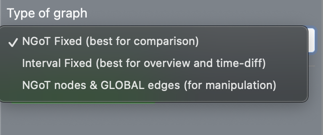
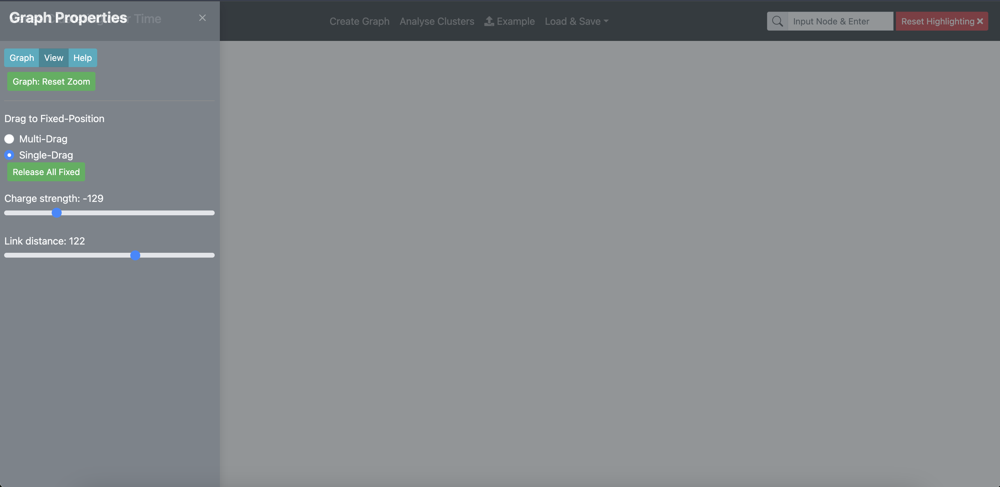
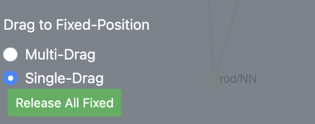
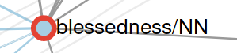
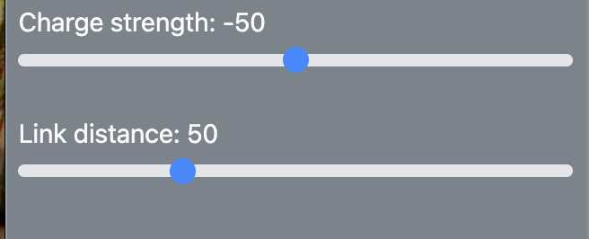
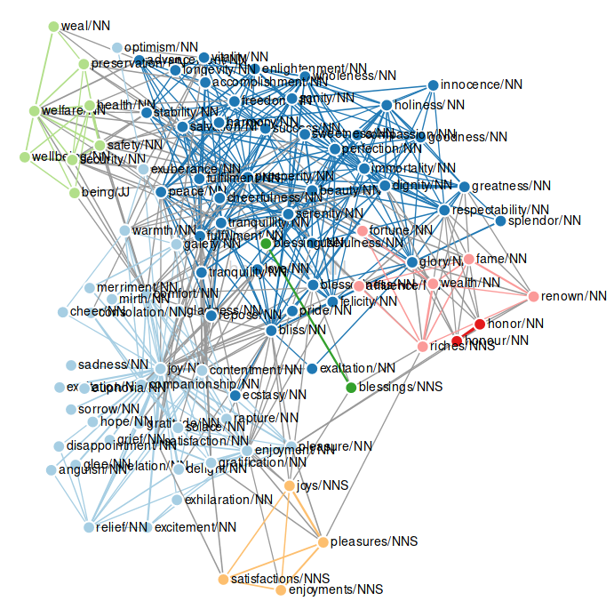
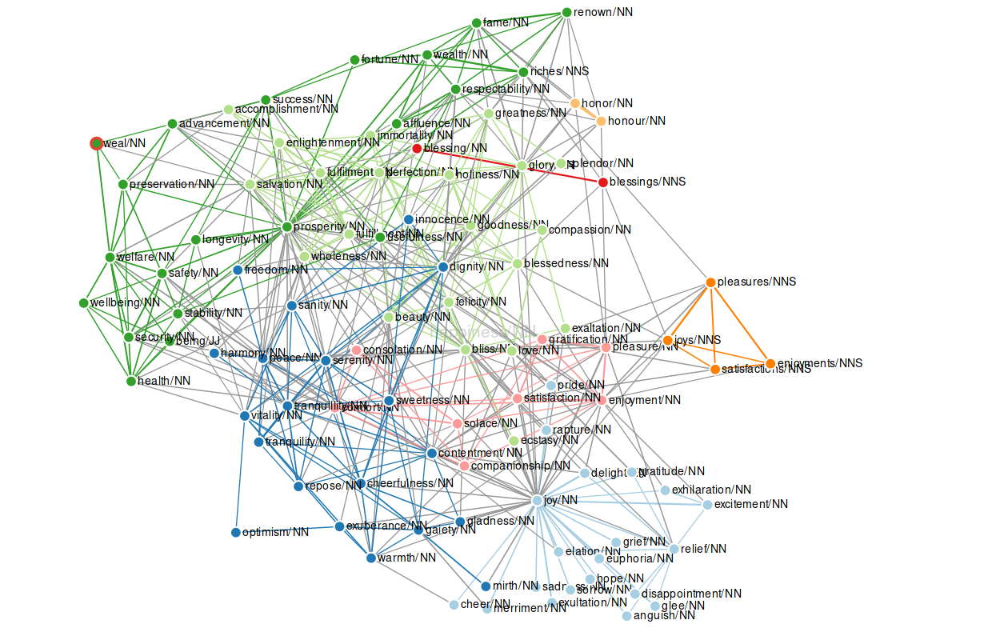
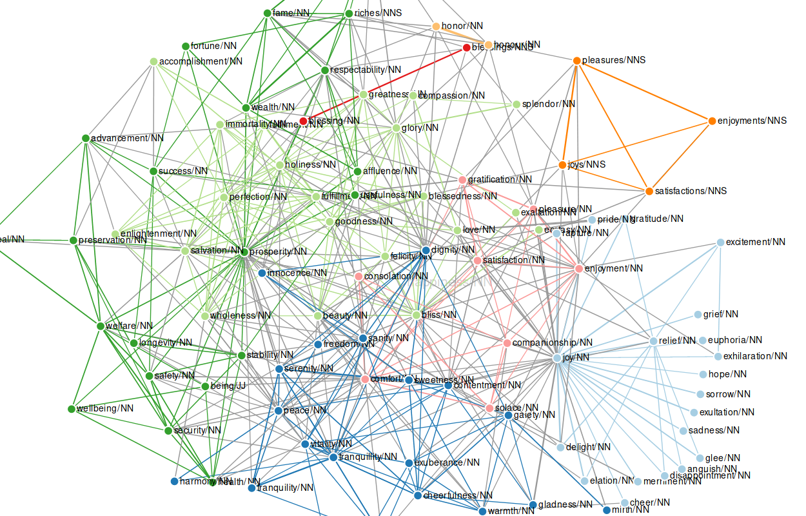
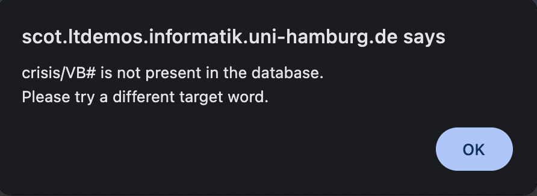

<!-- # Introduction

[Back to user guide contents list](userGuide.md)

SCoT is a scholarly software for the graph-based analysis of distributional semantics over time. There are many use cases. SCoT has been utilized, for example, to unearth the changing meaning of "network" from the medieval ages to the digital era. [Friedrich, Biemann 2016]

The user begins by selecting a precalculated corpus [1] using the Collection dropdown, which allows users to choose the corpus/database. Next, the user selects the Start of first interval, which defines the beginning year of the analysis, and the End of last interval, which defines the final year of the analysis [2], [3]. The user also specifies a target word [4]. The semantic metrics used by SCoT have been precalculated by the Language Technology Group using the JoBim Framework [and, in the case of Google Books, by Google]. The main purpose of SCoT is to analyze these metrics through clustered graph visualizations [9].

The user can control the size and density of the graph using two parameters:
the maximum number of the most similar words to the target word [5], and
the density of the interrelations between these words [6].

SCoT then selects the most semantically similar words across all time slices. The key aspect of the analysis is the global threshold of paradigms (nodes) and their interrelations (edges), which is defined by the user. This global limit determines which nodes are considered “born” or “dying” across the selected time slices [3,4]. Each corpus comes with a predefined parameter configuration, but users are encouraged to experiment with different settings to better understand their effects. After configuring all parameters, the graph can be generated by clicking **"Create and Cluster Graph"** [8].

The user can also choose the **Type of Graph** [7] depending on the analytical goal:

NGoT Fixed - Maintains a more consistent graph structure across time intervals, making it easier to compare semantic changes over time. Best suited for studying how relationships between words evolve over time.

Interval Fixed - Focuses on interval-specific semantic relationships to better highlight semantic differences between time periods. Useful for identifying emerging, changing, or disappearing concepts across periods.

NGoT nodes & GLOBAL edges - Uses globally computed semantic connections, resulting in a dense and highly connected graph.
Best suited for exploratory analysis and flexible graph manipulation.

The image below shows the general structure of the web interface after rendering a graph for the query "happiness/NN". 
The resulting graph displays the maximum values across time slices. The corresponding time slices can be explored through the tooltips of nodes [4] and edges [5], and can also be visualized using different modes via the **Analyse Clusters** [2].
After initial graph has been generated by SCoT, users can also save it as JSON, SVG, or PNG by using the "Load & Save" menu shown in the image below. Previously saved graphs in JSON format can also be later reloaded and rendered again.
 

Most of the functionality of SCoT is accessible through three main interaction areas within the application:

[1] The **Create Graph** Button slides out the Graph-Menu on the left which enables the shaping of the graph and the editing of the view settings that shape the display of the graph.  
[More info on the settings sidebar](renderingGraph.md)  

[2] The **Analyse Clusters** Button - brings up the cluster analysis section on the right-hand side for cluster editing/inspection, along with time-diff mode and advanced graph functions.  
[More info on the analysis options](clusters.md)  
[More info on the time-diff mode](timeDiff.md)  
[More info on the Functions](Functions.md)

[3] Nodes and edges support interactive context-mining functions such as hover tooltips, and contextual analysis on click.
[More info about the Context-Mining section](context.md).

[4] Overview of the [Top Navigation bar](navbar.md) -->

# Create and Render a Graph {#create-and-render}

[Back to user guide contents list](userGuide.md)

This page explains how to create a new graph in SCoT and how to adjust the graph after it has been rendered.

After clicking **Create Graph** in the top navigation bar, the Graph Properties sidebar opens on the left-hand side of the interface. It provides main controls for: creating and updating graphs, configuring graph parameters, and adjusting visualization and interaction settings.

As shown in the image above, the sidebar contains three main tabs:
* 1) [Graph Tab for Graph Creation](#graph-tab) 
* 2) [The View Tab for graph visualization and interaction](#view-settings)
* 3) [Help Tab](#help-settings)

## 1) Graph Tab {#graph-tab}

## Creating a Graph

To create a graph in SCoT, the user configures the main graph parameters in the **Graph** tab of the Graph Properties sidebar.

The user needs to:

* Select a precalculated corpus using the **Collection** dropdown.

  * This determines which corpus or database will be used for the analysis.

* Select the **Start of first interval**.

  * This defines the beginning year of the analysis.

* Select the **End of last interval**.

  * This defines the final year of the analysis.

* Enter a **target word**.

  * This is the word whose semantic neighbourhood will be analyzed. (The semantic metrics used by SCoT have been precalculated by the Language Technology Group using the JoBim Framework [and, in the case of Google Books, by Google])

* Set the maximum number of similar words.

  * This controls how many of the most semantically similar words to the target word are included as nodes.

* Set the density of interrelations between words.

  * This controls how many connections, or edges, are created between the selected words.

* Choose the [Type of Graph](#choose-the-type-of-graph) depending on the analytical goal.

* Click **Create and Cluster Graph**.

  * SCoT then generates the graph and applies clustering.

<!-- The user begins by selecting a precalculated corpus [1] using the Collection dropdown, which allows users to choose the corpus/database. Next, the user selects the Start of first interval, which defines the beginning year of the analysis, and the End of last interval, which defines the final year of the analysis [2], [3]. The user also specifies a target word [4]. The semantic metrics used by SCoT have been precalculated by the Language Technology Group using the JoBim Framework [and, in the case of Google Books, by Google]. The main purpose of SCoT is to analyze these metrics through clustered graph visualizations [9].

The user can control the size and density of the graph using two parameters:
the maximum number of the most similar words to the target word [5], and
the density of the interrelations between these words [6]. -->

SCoT then selects the most semantically similar words across all time slices. The key aspect of the analysis is the global threshold of paradigms (nodes) and their interrelations (edges), which is defined by the user. This global limit determines which nodes are considered “born” or “dying” across the selected time slices. Each corpus comes with a predefined parameter configuration, but users are encouraged to experiment with different settings to better understand their effects. 

### Choose the Type of Graph {#choose-the-type-of-graph}

The Type of Graph setting determines how nodes and edges are selected across time slices. The three options for this are:

1) **NGoT Fixed** - Maintains a more consistent graph structure across time intervals, making it easier to compare semantic changes over time. Best suited for studying how relationships between words evolve over time.

2) **Interval Fixed** - Focuses on interval-specific semantic relationships to better highlight semantic differences between time periods. Useful for identifying emerging, changing, or disappearing concepts across periods.

3) **NGoT nodes & GLOBAL edges** - Uses globally computed semantic connections, resulting in a dense and highly connected graph.
Best suited for exploratory analysis and flexible graph manipulation.

### Interacting with the Rendered Graph {#interacting-with-the-rendered-graph}

After a graph has been created, users can interact with individual nodes and edges to explore the graph in more detail.

The nodes may appear in different sizes. By default, SCoT resizes nodes according to their average semantic similarity with the target word across all selected time intervals. Larger nodes therefore represent words that have a stronger semantic relationship with the target word over time.

Clicking on a node opens the node-level analysis sidebar on the right-hand side of the interface. This sidebar allows users to inspect the selected word in more detail and explore the linguistic context behind its relationship with the target word.

To learn more about node-level analysis continue with: [Node Level Analysis](context.md)

[To the top](#create-and-render)

##  2) View Settings {#view-settings}
The View section contains settings related to graph visualization and interaction.
Available options include:
- resetting the visualization to default settings,
- enabling interaction with the graph,
- selecting node dragging behaviour,
- and modifying force-simulation parameters.

SCoT uses a force-directed layout algorithm to position graph nodes dynamically.

## 1. Choosing the Dragging Behaviour

SCoT provides two different node-dragging modes.

### Single-Drag

Single-Drag is the default dragging behaviour.

- Only one node can be selected and moved at a time.
- The remaining nodes reposition automatically according to the force simulation. 
- Dragged node becomes fixed in its new position, which means that its position does not change if the force parameters are updated or other nodes dragged somewhere.

The user selects a node by clicking on it. Then the selected node is marked with a red circle around it.

### Multi-Drag

Multi-Drag allows users to select multiple nodes at the same time using a brush movement and dragging all of them at the same time to a different position. This dragging pauses the force simulation, meaning you can select a node and drag it around without any other nodes following. Again, nodes that have been dragged are fixed to their position from then on.

### Release Fixed Nodes

All manually dragged/fixed nodes can be released by clicking the "Release All Fixed" button. This allows the force simulation to reposition the nodes dynamically again.

[To the top](#create-and-render)

## 2. Manipulate the Simulation

SCoT allows the user to edit two simulation parameters that are used to arrange the graph nodes:
- Charge Strength
- Link Distance

<!-- The default value for the charge strength is -50, the default value for the link distance is 50. -->
A graph with 100 nodes, 30 edges and simulation parameter values of charge strength = -50 and link distance = 50 looks like this:

{:height="75%" width="75%"}

The user can change the value of the charge strength from values in the range of -200 to 100. Changing the charge strength influences the repelling forces between the nodes. The same graph with a charge strength of -100 and the default link distance looks as follows:

As a rule of thumb, a negative charge strength pushes the nodes further apart, simulating repulsion, and a positive charge strength pushes nodes together, simulating gravity or attraction.

The link distance influences the distance between nodes and therefore the length of the edges between them. A high link distance means a long distance between nodes, a low link distance means a small distance between nodes. The following example shows the graph with a link distance of 150 and the default charge.

 

[To the top](#create-and-render)

<!-- Leave note -->
**Note:** For the Google Books data, the respective part-of-speech tag needs to be appended to the query word. The correct query word for “crisis” would therefore be “crisis/NN” or “crisis/NNP”. The data uses the [Penn Treebank POS tags](https://www.ling.upenn.edu/courses/Fall_2003/ling001/penn_treebank_pos.html). Other data might have different tags, or none.

If the user enters a target word, for which there is no match in the database, they will recieve the following alert.

[To the top](#create-and-render)

## 3) Help Tab {#help-settings}
The Help tab provides quick access to additional information about SCoT, including the research paper, demo video, user guide, and source code.

[To the top](#create-and-render)

---
Continue with: [Node Level Analysis](context.md)

