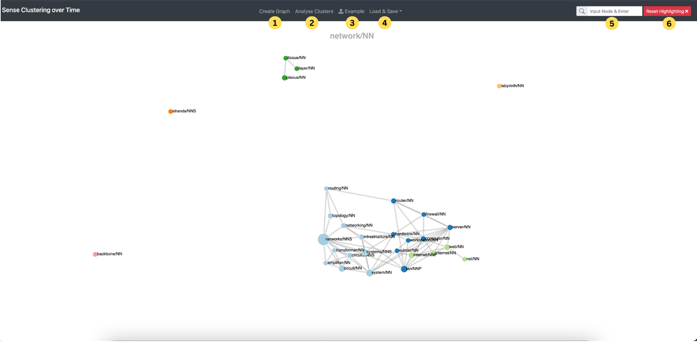
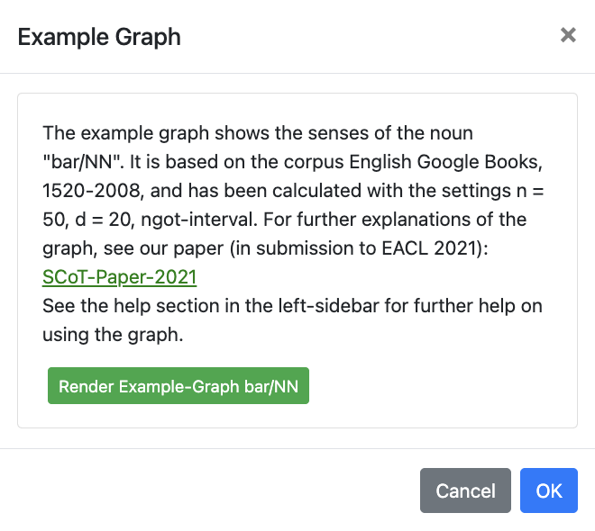
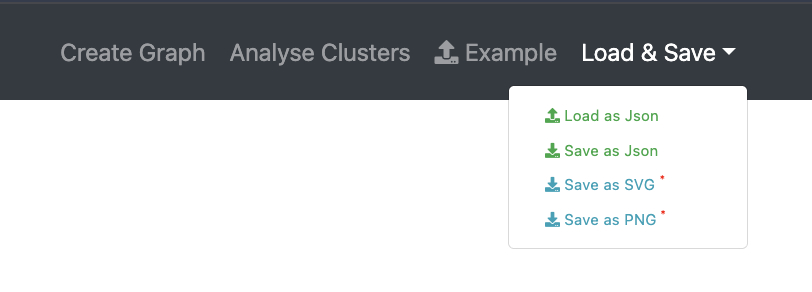
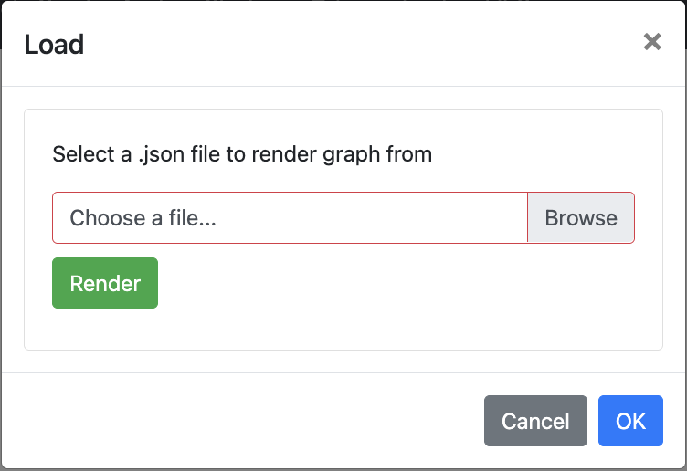
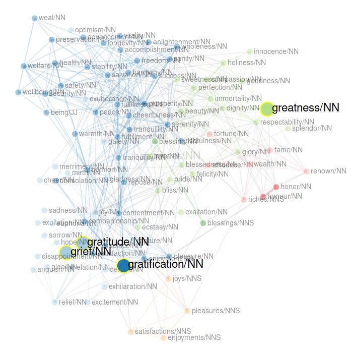
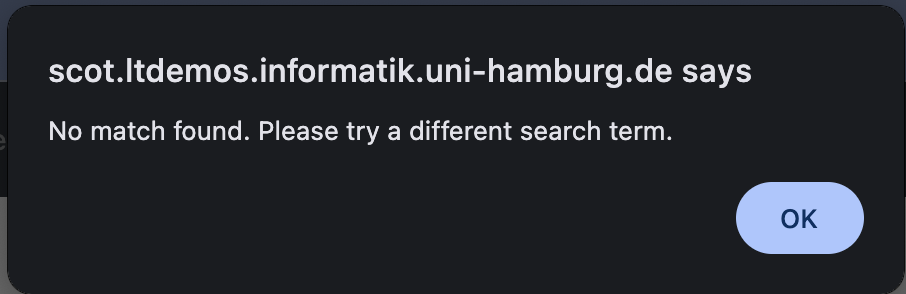
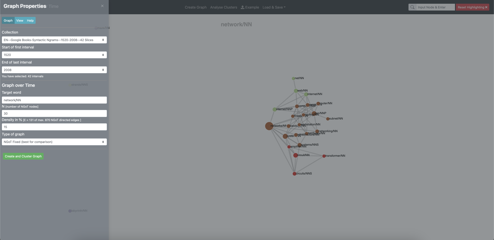
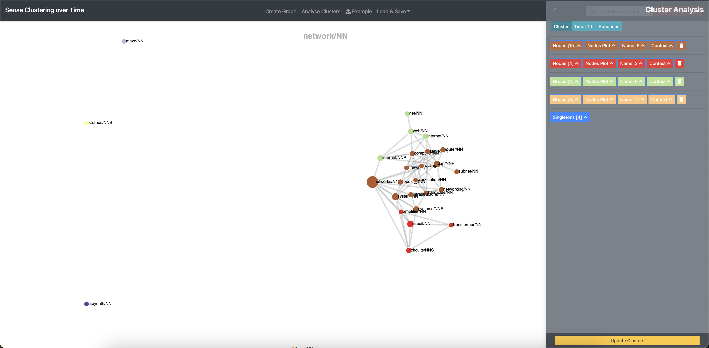

<!--
# The Functions of the Navbar

[Back to user guide contents list](userGuide.md)

The navigation bar provides several functionalities that help users navigate and interact with the SCoT website.

* [Create New Graph](#create-new-graph)
* [Analyse Clusters](#betweenness-centrality)
* [The Search Function](#the-search-function)
* [Save the Current Graph](#save-the-current-graph)
* [Load a Previously Saved Graph](#load-a-previously-saved-graph)
* [Load an Example Graph](#load-an-example-graph)
* [Reset Highlighting](#reset-highlighting)



## 1. Create New Graph
The "Create Graph" Button slides out the Graph-Menu on the left which allows users to select the corpus, define the target word, choose the graph type,
and configure various other graph visualization settings that shape the display of the graph. [More Information on Graph creation](intro.md)  

[To the top](#the-functions-of-the-navbar)

## 2. Analyse Clusters
Clicking the button "Analyse Clusters" toggles the Cluster Analysis sidebar on the right-hand side of the screen. This panel provides tools for:

* cluster inspection and editing,
* time-difference analysis,
* and advanced graph functions.

More information:
* [Cluster Analysis](clusters.md)
* [Time-Diff Mode](timeDiff.md)
* [Functions Menu](Functions.md) 

[To the top](#the-functions-of-the-navbar)

## 3. Load an Example Graph

The "Example Graph" button opens a popup that allows users to render a predefined example graph based on the noun "bar/NN".



The example graph uses the English Google Books corpus. By clicking “Render Example-Graph bar/NN”, the graph is generated and can then be explored and modified interactively.

[To the top](#the-functions-of-the-navbar)

## 4. Load & Save 

The "Load & Save" button opens a dropdown menu containing options for saving the current graph or loading an existing graph.


#### Load a Previously Saved Graph

A graph that has been previously saved to a json file can be loaded into SCoT again via clicking "Load as Json". When clicking on the button a panel is opened where you can browse for your desired graph.json file in your file system.



Select your file, click "Render" and continue to work on your graph.

#### Save the Current Graph

You can save a graph you have been working to a local JSON file or as an image in the SVG/PNG form by clicking the respective button. The name of the files is composed of the input parameters, e.g. happiness_NN_100_30.filetype. This is the graph for the targetword "happiness/NN" with 100 nodes and 30 edges per node. Where your graph is saved depends on your browser settings.

The json file has the following format (pseudo code):
```
{
  "links": [
    {
      "source": "joy/NN",
      "target": "gladness/NN",
      "weight": "285",
      "colour": "#a6cee3"
    },
    ...
   ],

  "nodes": [
    {
      "id": "joy/NN",
      "x": 792.6155156103733,
      "y": 727.7865505385854,
      "class": "8",
      "cluster_name": "8",
      "cluster_node": "false",
      "colour": "#a6cee3",
      "time_ids": "7,5,6,4,8,3,2",
      "centrality_score": "0.3214285714285714"
    },
    ...
  ],

  "singletons": [
    "comfort/NN"
  ],

  "target": "happiness/NN",
  "link_distance": 50,
  "charge": -50,
  "start_year": 1520,
  "end_year": 2008,
  "time_diff": false,
  "senses": "10",
  "edges": "3"
}

```

[To the top](#the-functions-of-the-navbar)


## 5. The Search Function

Since graphs with many nodes and links can get very complex, the user can search the graph for specific nodes. The search used prefix matching between the search term and the node labels. If one or more nodes that match the search term are found, they are highlighted in the graph.

The following image shows the highlighted search results of the search for "gr".

{:height="50%" width="50%"}


If the search does not yield any results, an alert is also displayed.

{:height="50%" width="50%"}

[To the top](#the-functions-of-the-navbar)

## 6. Reset Highlighting

The "Reset Highlighting" button clears all active graph highlighting.

This includes:
search highlighting,
cluster highlighting,
and any highlighting generated through the Cluster Analysis tools. 

[To the top](#the-functions-of-the-navbar)
-->

# Introduction {#introduction}

[Back to user guide contents list](userGuide.md)

SCoT is scholarly software for the graph-based analysis of distributional semantics over time. It allows users to explore how the meanings and semantic relationships of words change across historical time periods.

For example, SCoT has been used to study the changing meaning of words such as "network" from the medieval period to the digital era. [Friedrich, Biemann 2016](https://www.inf.uni-hamburg.de/en/inst/ab/lt/publications/2016-friedrich-biemann-digitale-begriffsgeschichte.pdf)

## Website Interface Overview

After opening SCoT, most functionality is accessible through the top navigation bar that help users navigate and interact with the website.


The main navigation options are:

* 1) [Create New Graph](#create-new-graph)
* 2) [Analyse Clusters](#analyse-clusters)
* 3) [Load an Example Graph](#load-an-example-graph)
* 4) [Load & Save](#load-and-save)
* 5) [The Search Function](#the-search-function)
* 6) [Reset Highlighting](#reset-highlighting)


## 1. Create New Graph {#create-new-graph}
The "Create Graph" Button slides out the Graph-Menu on the left which allows users to select the corpus, define the target word, choose the graph type,
and configure various other graph visualization settings that shape the display of the graph. [More Information on Graph creation](create-and-render.md) 



[To the top](#introduction)

## 2. Analyse Clusters {#analyse-clusters}
Clicking the button "Analyse Clusters" toggles the Cluster Analysis sidebar on the right-hand side of the screen. This panel provides tools for:

* 1) cluster inspection and editing,
* 2) time-difference analysis,
* 3) and advanced graph functions.



More information:
* [Cluster Analysis](clusters.md)
* [Time-Diff Mode](timeDiff.md)
* [Functions Menu](Functions.md) 

[To the top](#introduction)

## 3. Load an Example Graph {#load-an-example-graph}

The "Example Graph" button opens a popup that allows users to render a predefined example graph based on the noun "bar/NN".

{:height="50%" width="50%"}

The example graph uses the English Google Books corpus. By clicking "Render Example-Graph bar/NN", the graph is generated and can then be explored and modified interactively.

[To the top](#introduction)

## 4. Load & Save {#load-and-save}

The "Load & Save" button opens a dropdown menu containing options for saving the current graph or loading an existing graph.


#### Load a Previously Saved Graph

A graph that has been previously saved to a json file can be loaded into SCoT again via clicking "Load as Json". When clicking on the button a panel is opened where you can browse for your desired graph.json file in your file system.

{:height="50%" width="50%"}

Select your file, click "Render" and continue to work on your graph.

#### Save the Current Graph

You can save a graph you have been working to a local JSON file or as an image in the SVG/PNG form by clicking the respective button. The name of the files is composed of the input parameters, e.g. happiness_NN_100_30.filetype. This is the graph for the targetword "happiness/NN" with 100 nodes and 30 edges per node. Where your graph is saved depends on your browser settings.

The json file has the following format (pseudo code):
```
{
  "links": [
    {
      "source": "joy/NN",
      "target": "gladness/NN",
      "weight": "285",
      "colour": "#a6cee3"
    },
    ...
   ],

  "nodes": [
    {
      "id": "joy/NN",
      "x": 792.6155156103733,
      "y": 727.7865505385854,
      "class": "8",
      "cluster_name": "8",
      "cluster_node": "false",
      "colour": "#a6cee3",
      "time_ids": "7,5,6,4,8,3,2",
      "centrality_score": "0.3214285714285714"
    },
    ...
  ],

  "singletons": [
    "comfort/NN"
  ],

  "target": "happiness/NN",
  "link_distance": 50,
  "charge": -50,
  "start_year": 1520,
  "end_year": 2008,
  "time_diff": false,
  "senses": "10",
  "edges": "3"
}

```

[To the top](#introduction)


## 5. The Search Function {#the-search-function}

Since graphs with many nodes and links can get very complex, the user can search the graph for specific nodes. The search used prefix matching between the search term and the node labels. If one or more nodes that match the search term are found, they are highlighted in the graph.

The following image shows the highlighted search results of the search for "gr".

{:height="50%" width="50%"}


If the search does not yield any results, an alert is also displayed.

{:height="50%" width="50%"}

[To the top](#introduction)

## 6. Reset Highlighting {#reset-highlighting}

The "Reset Highlighting" button clears all active graph highlighting. Pressing the Escape/Esc key is also a shortcut for the Reset Highlighting functionality to work. 

This includes:
search highlighting,
cluster highlighting,
and any highlighting generated through the Cluster Analysis tools. 

---
To learn how to create and render a graph, continue with:
[Create and Render a Graph](create-and-render.md) 
